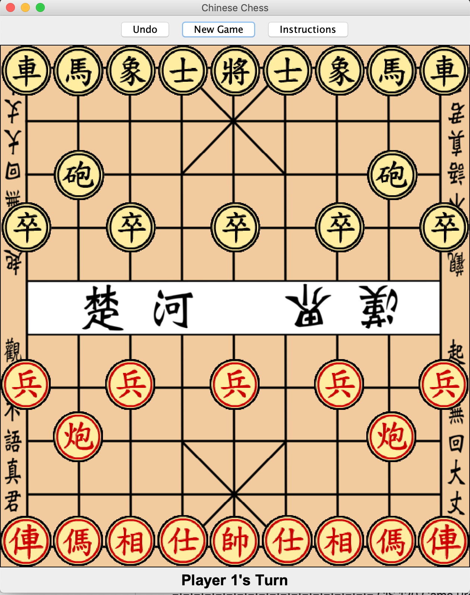

===================
=: Screen Shots :=
===================
  
  

===================
=: Core Concepts :=
===================

  1. 2D arrays - organizes the pieces in an array with the dimensions of the 
  game board. Movement on the board is recorded and saved by changing the 
  array. Using a 2D array is appropriate for modeling the game board since 
  they are both grid-like in structure, and the existence of null in an array
  is a good way to model the lack of a piece.

  2. Subtyping - there is an abstract class Piece that allows implementations
  of the pieces to all conform to a certain signature. Also, it prevents the
  redundancy of several trival getter and setter methods within the
  implementation classes of the specific pieces. This is an appropriate use 
  of subtyping, as it organizes the specific pieces under the Piece "umbrella"
  and forces the Pieces to behave consistently as this is important for 
  generalized movement logic within the GameBoard class.

  3. Collections - a Deque data structure allows for the saving and retrieval
  of board states. After every turn, the state of the board is saved and put
  at the end of the deque. When a player undos, the previous board state is
  retreived and loaded into the game. Using a Deque is an appropriate for this 
  feature as it allows for easy length scaling, saving, and retrieval of the 
  board states.
  
  I realized that my proposed idea of using collections (that is, just
  keeping sets of each player's alive pieces) was modeling the same state 
  as the 2D array, I implemented the undo button as a way to use collections,
  but not make a redundant model.

  4. JUnit Testing - since each implementation of the pieces knows all of the
  quirks of their respective movements, it is important to JUnit test the pieces
  to make sure that they are "moving" according to the rules of the game. JUnit
  testing allows me to focus in on individual aspects of movement.

=========================
=: Your Implementation :=
=========================

  
  Piece - This is the abstract class of the pieces. It contains unimplemented
  methods for movement and getters and setters for the general Piece
  characteristic (fields). As described above, this allows the GameBoard to
  have a more generalized movement logic that only needs to work for a generic
  Piece. Each implemented pieces knows where it is on the board and how to (and
  whether it can) move itself.
  
  Advisor - This is an implementation of the advisor piece in the game. The
  class contains methods for identifying a legal move and movement.
  
  Cannon - This is an implementation of the cannon piece in the game. The
  class contains methods for identifying a legal move and movement.
  
  Chariot - This is an implementation of the chariot piece in the game. The
  class contains methods for identifying a legal move and movement.
  
  Elephant - This is an implementation of the elephant piece in the game. The
  class contains methods for identifying a legal move and movement.
  
  Game - This is the class that is run when the game is to be booted up. It 
  implements runnable and contains the main method and the run method. This
  class also initializes the game's frame and inner panels for controlling the
  game.
  
  GameBoard - This is the class that handles almost all of the game logic. It
  gets the click information from the mouse, and handles the piece movement
  accordingly. It also contains the "actions" as a result of the button clicks
  from the control panel.
  
  General - This is an implementation of the general piece in the game. The
  class contains methods for identifying a legal move and movement. If you 
  lose your general, you lose the game. Capturing your opponent's general wins
  you the game.
  
  Horse - This is an implementation of the horse piece in the game. The
  class contains methods for identifying a legal move and movement.
  
  Soldier - This is an implementation of the soldier piece in the game. The
  class contains methods for identifying a legal move and movement. The
  soldier also knows how it can move depending on where it is on the board.
